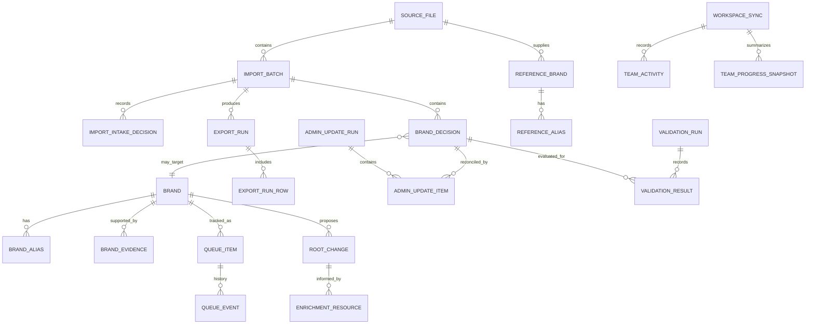

# Brandmaster BigQuery Data Model (Proposed)

## Purpose and status

This proposal maps the entities Brandmaster currently imports, generates, and synchronizes to a relational BigQuery reporting model. BigQuery is the proposed analytical store and transformation layer. This does **not** mean a BigQuery connector currently exists: the application workspace is currently stored locally and synchronized through the configured shared workspace backend (GitHub or NuKV). A future, approved export/ingestion pipeline would populate these tables.

The model keeps operational facts (imports, reviewed decisions, queue, exports, admin outcomes) separate from reference data (Root, ACA, FPA, UBQ, aliases) and from derived reporting views. Preserve source payloads in a restricted raw dataset, then validate and transform into curated datasets.

## Relationship diagram

`BRAND_DECISION` is the central reviewed work item. `BRAND` is the canonical brand identity table; unresolved source brands remain in decisions/work items and do not need a canonical record until created or matched. `REFERENCE_BRAND` stores snapshots from each imported reference source and is keyed by source plus source record ID, since one brand can appear in Root, ACA, FPA, and UBQ with different identifiers.

## Proposed datasets

| Dataset | Purpose | Access posture |
| --- | --- | --- |
| `brandmaster_raw` | Immutable or versioned source files and workspace snapshots | Restricted to ingestion and data owners |
| `brandmaster_stage` | Parsed, typed source records awaiting validation | Ingestion/transformation identities and approved maintainers |
| `brandmaster_curated` | Normalized operational and reference tables | Role-based access; reporting reads curated views/tables |
| `brandmaster_reporting` | Stable views and aggregate facts for Looker | Read-only reporting identities; expose only approved fields |

Names and project/region are illustrative; confirm conventions with GCP Admin.

## Tables and schemas

Types use BigQuery Standard SQL. `JSON` is retained only for evolving source payloads or low-frequency nested attributes; fields needed for joins, filtering, permissions, or dashboards are first-class columns. All tables should include `ingested_at TIMESTAMP` and `source_snapshot_id STRING` where applicable. Use `source_snapshot_id` to trace a row back to a file/workspace revision.

### 1. Ingestion and source lineage

**`brandmaster_raw.source_snapshot`** — one row per received file or workspace export.

| Column | Type | Meaning |
| --- | --- | --- |
| source_snapshot_id | STRING | Stable ingestion ID (PK) |
| source_system | STRING | `brandmaster`, `ubq`, `root`, `aca`, `fpa`, `historical_mapping`, etc. |
| source_kind | STRING | `WORKSPACE`, `CSV`, `JSON`, `MANUAL_UPLOAD`, `API` |
| source_filename | STRING | Original filename when applicable |
| source_uri | STRING | Approved storage location; no secrets |
| source_revision | STRING | Workspace revision, file checksum, or upstream version |
| source_schema_version | STRING | Schema version if provided |
| extracted_at | TIMESTAMP | Source export time if known |
| ingested_at | TIMESTAMP | GCP receipt time |
| ingested_by | STRING | Service identity or initiating principal |
| row_count | INT64 | Parsed/source row count |
| content_sha256 | STRING | Integrity/deduplication fingerprint |
| load_status | STRING | `RECEIVED`, `LOADED`, `REJECTED`, `FAILED` |
| error_summary | STRING | Safe diagnostic, no credential material |
| raw_payload | JSON | Optional original payload when policy allows |

**`brandmaster_stage.workspace_record`** — optional staging representation for arrays/objects parsed from the shared `AppData` workspace.

| Column | Type | Meaning |
| --- | --- | --- |
| source_snapshot_id | STRING | FK to `source_snapshot` |
| collection_name | STRING | Workspace collection, e.g. `batches`, `rootBrands`, `exportRuns` |
| source_record_id | STRING | Record's application ID where available |
| row_number | INT64 | Source order for file-based data |
| payload | JSON | Parsed source record pending normalization |
| validation_status | STRING | `PENDING`, `VALID`, `REJECTED` |
| validation_errors | ARRAY<STRING> | Validation findings |
| ingested_at | TIMESTAMP | GCP receipt time |

### 2. Brand identity and aliases

**`brandmaster_curated.brand`** — canonical brand record used for accepted/created brands. Source references remain in `reference_brand`.

| Column | Type | Meaning |
| --- | --- | --- |
| brand_id | STRING | Canonical Brand ID (PK; e.g. `brand_...`) |
| brand_name | STRING | Canonical display name |
| normalized_name | STRING | Normalized comparison key |
| category | STRING | Brand category when known |
| website | STRING | Approved website field |
| country | STRING | Country when known |
| same_as | STRING | External/equivalent identifier text where supplied |
| root_source | STRING | Root provenance where supplied |
| root_status | STRING | Root status where supplied |
| bulk_mapping_at | TIMESTAMP | Root bulk mapping timestamp where supplied |
| lifecycle_status | STRING | Proposed normalized lifecycle/status |
| first_seen_at | TIMESTAMP | Earliest source observation |
| last_seen_at | TIMESTAMP | Latest source observation |
| source_snapshot_id | STRING | Source snapshot that provided current version |
| attributes | JSON | Remaining approved, infrequently used attributes |

**`brandmaster_curated.brand_alias`** — one row per alias; avoids repeated nested-array operations.

| Column | Type | Meaning |
| --- | --- | --- |
| brand_alias_id | STRING | Warehouse row ID (PK) |
| brand_id | STRING | FK to `brand.brand_id` |
| alias | STRING | Alias string |
| normalized_alias | STRING | Normalized alias key |
| alias_source | STRING | `ROOT`, `ACA`, `FPA`, `MANUAL`, `ENRICHMENT` |
| source_record_id | STRING | Source-specific brand identifier |
| is_approved | BOOL | Approval status if known |
| source_snapshot_id | STRING | Lineage |

**`brandmaster_curated.brand_evidence`** — evidence attached to a brand or proposed enrichment.

| Column | Type | Meaning |
| --- | --- | --- |
| evidence_id | STRING | Evidence row ID (PK) |
| brand_id | STRING | Nullable FK when linked to canonical brand |
| decision_id | STRING | Nullable FK when evidence supports a decision |
| source_name | STRING | Evidence source |
| url | STRING | Evidence URL, if present |
| detail | STRING | Supporting detail; apply classification/retention policy |
| checked_at | TIMESTAMP | Check time |
| confidence | FLOAT64 | Optional confidence |
| source_snapshot_id | STRING | Lineage |

### 3. Imported work and reviewed decisions

**`brandmaster_curated.import_batch`** — an uploaded/imported work batch (`ImportBatch`).

| Column | Type | Meaning |
| --- | --- | --- |
| batch_id | STRING | Application batch ID (PK) |
| source_snapshot_id | STRING | FK to source snapshot |
| filename | STRING | Uploaded filename |
| created_at | TIMESTAMP | Batch creation time |
| created_by | STRING | User/principal |
| row_count | INT64 | Batch row count |
| workflow_source | STRING | `IMPORT`, `UBQ`, `ROOT` |
| owner | STRING | Batch owner if set |
| archived_at | TIMESTAMP | Archive time, nullable |
| archived_by | STRING | Archiving principal |
| admin_completed_at | TIMESTAMP | Admin completion time when supplied |
| admin_success_count | INT64 | Successful rows |
| admin_failure_count | INT64 | Failed rows |
| admin_result_filename | STRING | Result filename |

**`brandmaster_curated.source_brand_work_item`** — input row or unresolved brand identity from CSV/UBQ/Root/paste. Separates source row identity from later decisions.

| Column | Type | Meaning |
| --- | --- | --- |
| work_item_id | STRING | Stable work item ID (PK) |
| batch_id | STRING | FK to import batch, nullable for non-batch queue work |
| source_system | STRING | `IMPORT`, `UBQ`, `ROOT`, `PASTE`, `HISTORICAL` |
| source_brand_id | STRING | Original source ID / `UnmappedBrandID` |
| source_brand_name | STRING | Original source name |
| normalized_name | STRING | App normalized comparison name |
| listing_count | INT64 | Listing count if supplied |
| sku_count | INT64 | SKU count if supplied |
| seller_count | INT64 | Seller count if supplied by historical input |
| source_row_number | INT64 | Original file row |
| source_filename | STRING | Original file |
| first_seen_at | TIMESTAMP | First observation |
| last_seen_at | TIMESTAMP | Latest observation |
| source_snapshot_id | STRING | Lineage |

**`brandmaster_curated.import_intake_decision`** — records whether submitted rows were imported or excluded and why.

| Column | Type | Meaning |
| --- | --- | --- |
| intake_decision_id | STRING | Application ID (PK) |
| batch_id | STRING | FK to batch |
| work_item_id | STRING | Nullable FK if a work item was created |
| brand_name | STRING | Submitted brand string |
| outcome | STRING | `IMPORTED`, `NOT_IMPORTED` |
| reason | STRING | Intake rationale |
| review_again_allowed | BOOL | Whether explicit rerun is allowed |
| action | STRING | Optional action or `COMPLETED` |
| decision_date | TIMESTAMP | Intake decision date |
| completion_evidence | JSON | UBQ/history/Root evidence and conclusion |
| source_snapshot_id | STRING | Lineage |

**`brandmaster_curated.brand_decision`** — reviewed mapping/brand decision (`BrandRecord`), central fact table. One row per decision version; retain revisions rather than silently overwriting history.

| Column | Type | Meaning |
| --- | --- | --- |
| decision_id | STRING | Application record ID (PK, versioned if needed) |
| work_item_id | STRING | FK to source work item |
| batch_id | STRING | FK to batch |
| brand_id | STRING | Canonical brand FK when resolved/created |
| action | STRING | `CREATE`, `MERGE`, `SKIP`, `DELETE` |
| target_brand_id | STRING | Target ID for MERGE or created target where applicable |
| target_brand_name | STRING | Target/candidate name |
| normalized_name | STRING | Normalized source brand |
| confidence | FLOAT64 | Recommendation confidence |
| reason | STRING | Reason for the decision |
| status | STRING | App status such as ready/reviewed/needs-review |
| workflow_stage | STRING | `FIRST_REVIEW`, `SECOND_REVIEW`, `READY_TO_UPLOAD`, `DOWNLOADED`, `ADMIN_CONFIRMED`, `SOURCE_VERIFIED`, `CLOSED_WITHOUT_MAPPING` |
| decision_source | STRING | Validation/recommendation source |
| workflow_source | STRING | `IMPORT`, `UBQ`, `ROOT` |
| first_reviewed_by | STRING | First reviewer |
| first_reviewed_at | TIMESTAMP | First review time |
| second_review_requested_by | STRING | Requesting reviewer |
| second_review_requested_at | TIMESTAMP | Request time |
| second_review_reason | STRING | Handoff reason |
| second_reviewed_by | STRING | Second reviewer |
| second_reviewed_at | TIMESTAMP | Second review time |
| approved_by | STRING | Approver |
| approved_at | TIMESTAMP | Approval time |
| reviewer | STRING | Latest/legacy reviewer field |
| reviewed_at | TIMESTAMP | Latest/legacy review time |
| notes | STRING | Review notes; access/retention controlled |
| evidence | ARRAY<STRING> | Decision evidence references/text |
| suggested_aliases | ARRAY<STRING> | Proposed aliases |
| triage_resolution | STRING | Triage resolution, if any |
| triage_resolution_note | STRING | Triage note |
| excluded_from_export | BOOL | Whether omitted from upload output |
| admin_upload_status | STRING | `SUCCESS`, `FAILED`, or null |
| admin_uploaded_at | TIMESTAMP | Upload confirmation time |
| admin_uploaded_by | STRING | Upload confirmer |
| created_brand_id | STRING | ID returned for a created brand |
| merge_override | BOOL | Whether merge target was overridden |
| priority_queue_id | STRING | FK to queue item, nullable |
| ai_brand_type | STRING | Optional classification enum |
| ai_brand_signals | ARRAY<STRING> | Optional classification signals |
| record_payload | JSON | Less common application fields not yet modeled |
| valid_from | TIMESTAMP | Version effective time |
| valid_to | TIMESTAMP | Version end time, null while current |
| is_current | BOOL | Current decision version |
| source_snapshot_id | STRING | Lineage |

Store `relatedUbq`, target chains, prior decision context, and other nested evolving application attributes either as child tables if they become query-critical or in `record_payload` initially. Do not persist secrets such as API keys from validation settings.

### 4. Reference imports and validation

**`brandmaster_curated.reference_brand`** — normalized rows from ACA, FPA, Root, UBQ, and other approved reference tables.

| Column | Type | Meaning |
| --- | --- | --- |
| reference_brand_key | STRING | Warehouse key (PK) |
| source_system | STRING | `ACA`, `FPA`, `ROOT`, `UBQ`, `BUILT_IN`, `MANUAL` |
| source_record_id | STRING | Source brand ID |
| brand_name | STRING | Source display name |
| normalized_name | STRING | Normalized comparison key |
| category | STRING | Category if provided |
| website | STRING | Website if provided |
| country | STRING | Country if provided |
| status | STRING | Source status |
| same_as | STRING | Source equivalent identifier |
| root_source | STRING | Root source detail |
| bulk_mapping_at | TIMESTAMP | Root mapping time if present |
| source_row_number | INT64 | Source row |
| source_filename | STRING | Imported filename |
| imported_at | TIMESTAMP | Import time |
| source_snapshot_id | STRING | FK to snapshot |
| source_attributes | JSON | Other source-specific fields |

**`brandmaster_curated.reference_alias`** columns: `reference_alias_id STRING`, `reference_brand_key STRING`, `alias STRING`, `normalized_alias STRING`, `source_snapshot_id STRING`. One row per alias from source arrays.

**`brandmaster_curated.historical_mapping`** — imported prior decisions/history.

| Column | Type | Meaning |
| --- | --- | --- |
| historical_mapping_id | STRING | PK |
| source_brand_id | STRING | Stable source ID if supplied |
| brand_name | STRING | Historical name |
| normalized_name | STRING | Normalized name |
| action | STRING | Prior action |
| original_action | STRING | Original source text |
| target_brand_id | STRING | Prior target ID |
| target_brand_name | STRING | Prior target name |
| decision_date | TIMESTAMP | Historical date |
| reviewer | STRING | Reviewer if supplied |
| listing_count | INT64 | Optional |
| seller_count | INT64 | Optional |
| notes | STRING | Optional notes |
| source_row_number | INT64 | Source row |
| source_filename | STRING | Source filename |
| imported_at | TIMESTAMP | GCP/app import time |
| source_snapshot_id | STRING | Lineage |

**`brandmaster_curated.validation_run`** and **`validation_result`** — proposed analytical audit of validation processing. These do not currently appear as standalone durable application records, so capture them only if the owners want reproducible validation analytics.

- `validation_run`: `validation_run_id STRING` (PK), `batch_id STRING`, `started_at TIMESTAMP`, `completed_at TIMESTAMP`, `settings_snapshot JSON` (exclude secrets), `application_version STRING`, `source_snapshot_id STRING`.
- `validation_result`: `validation_result_id STRING` (PK), `validation_run_id STRING`, `work_item_id STRING`, `module_name STRING`, `matched_reference_key STRING`, `result_action STRING`, `confidence FLOAT64`, `reason STRING`, `created_at TIMESTAMP`.

### 5. Queue, review activity, learning, and cleanup

**`brandmaster_curated.priority_queue_item`** — one row per shared work queue item.

| Column | Type | Meaning |
| --- | --- | --- |
| queue_item_id | STRING | Application ID (PK) |
| work_item_id | STRING | FK to source work item |
| brand_id | STRING | Source brand ID carried by queue |
| brand_name | STRING | Work display name |
| source | STRING | `CSV`, `PASTE`, `UBQ`, `ROOT` |
| listing_count | INT64 | Optional |
| sku_count | INT64 | Optional |
| status | STRING | `UNASSIGNED`, `ASSIGNED`, `IN_REVIEW`, `BLOCKED`, `COMPLETED` |
| assigned_to | STRING | Current assignee |
| assigned_at | TIMESTAMP | Assignment time |
| created_at | TIMESTAMP | Creation time |
| created_by | STRING | Creator |
| updated_at | TIMESTAMP | Last update |
| completed_at | TIMESTAMP | Completion time |
| final_action | STRING | Final action |
| final_target_id | STRING | Final target |
| final_target_name | STRING | Final target name |
| final_reason | STRING | Final reason |
| external_status | STRING | Delivery/reconciliation state |
| verified_at | TIMESTAMP | Verification time |
| verified_by | STRING | Verifier |
| triage_resolution | STRING | Resolution, if closed without mapping |
| triage_resolution_note | STRING | Resolution note |
| learning_rule_id | STRING | Applied learning rule, if any |
| source_snapshot_id | STRING | Lineage |

`priority_queue_event`: `queue_event_id STRING` (PK), `queue_item_id STRING` (FK), `event_type STRING`, `event_at TIMESTAMP`, `actor STRING`, `message STRING`, `source_snapshot_id STRING`.

`team_activity`: `activity_id STRING` (PK), `event_at TIMESTAMP`, `actor STRING`, `event_type STRING`, `message STRING`, `count INT64`, `batch_id STRING`, `source_snapshot_id STRING`. This reflects application collaboration activity; apply internal-user privacy controls.

`team_progress_snapshot`: `snapshot_id STRING` (PK), `snapshot_date DATE`, `cutoff_at TIMESTAMP`, `delta INT64`, `team_effort INT64`, `source STRING`, `reviewer STRING`, `batch_id STRING`, `is_immutable BOOL`, `source_snapshot_id STRING`. Reviewer-level information should not be exposed to general dashboards; publish aggregate-only views if needed.

`cleanup_confirmation`: `confirmation_id STRING` (PK), `source_system STRING`, `brand_id STRING`, `brand_name STRING`, `fingerprint STRING`, `status STRING`, `confirmed_at TIMESTAMP`, `confirmed_by STRING`, `reopened_at TIMESTAMP`, `reopened_by STRING`, `source_snapshot_id STRING`.

`root_change`: `root_change_id STRING` (PK), `change_type STRING`, `brand_id STRING`, `before_record JSON`, `after_record JSON`, `changed_fields ARRAY<STRING>`, `updated_at TIMESTAMP`, `status STRING`, `last_checked_at TIMESTAMP`, `admin_status STRING`, `admin_updated_at TIMESTAMP`, `admin_updated_by STRING`, `verification_note STRING`, `origin STRING`, `source_snapshot_id STRING`.

`enrichment_resource`: `enrichment_id STRING` (PK), `brand_id STRING`, `root_name STRING`, `root_aliases ARRAY<STRING>`, `proposed_name STRING`, `proposed_aliases ARRAY<STRING>`, `confidence FLOAT64`, `recommendation STRING`, `aca_match JSON`, `evidence JSON`, `generated_at TIMESTAMP`, `source_snapshot_id STRING`. Keep this optional and subject to approval because it can contain external research/evidence.

`learning_rule`: `rule_id STRING` (PK), `normalized_key STRING`, `action STRING`, `target_brand_id STRING`, `target_brand_name STRING`, `confidence FLOAT64`, `origin STRING`, `verification STRING`, `verified_at TIMESTAMP`, `updated_at TIMESTAMP`, `updated_by STRING`, `excluded_evidence ARRAY<STRING>`, `status STRING`, `rule_payload JSON`, `source_snapshot_id STRING`.

`learning_moderation_event`: `moderation_event_id STRING` (PK), `rule_id STRING` (FK), `event_type STRING`, `event_at TIMESTAMP`, `actor STRING`, `note STRING`, `source_snapshot_id STRING`.

### 6. Exports and downstream reconciliation

**`brandmaster_curated.export_run`** — each generated Admin CSV or other output artifact.

| Column | Type | Meaning |
| --- | --- | --- |
| export_run_id | STRING | Application ID (PK) |
| batch_id | STRING | FK to batch |
| filename | STRING | Output filename |
| created_at | TIMESTAMP | Export time |
| created_by | STRING | Exporting user |
| row_count | INT64 | Export row count |
| checksum | STRING | Output integrity fingerprint |
| status | STRING | `DOWNLOADED`, `PARTIALLY_CONFIRMED`, `ADMIN_CONFIRMED`, `SOURCE_VERIFIED` |
| admin_result_filename | STRING | Result filename |
| confirmed_at | TIMESTAMP | Confirmation time |
| confirmed_by | STRING | Confirmer |
| source_snapshot_id | STRING | Lineage |

`export_run_row`: `export_run_id STRING` (FK), `decision_id STRING` (FK), `row_number INT64`, `unmapped_brand_id STRING`, `unmapped_brand_name STRING`, `action STRING`, `target_brand_id STRING`, `target_brand_name STRING`, `row_status STRING`. Composite key: `(export_run_id, decision_id)`.

`admin_update_run`: `admin_update_run_id STRING` (PK), `filename STRING`, `exported_at TIMESTAMP`, `exported_by STRING`, `batch_id STRING`, `source_system STRING`, `source_snapshot_id STRING`.

`admin_update_item`: `admin_update_item_id STRING` (PK), `admin_update_run_id STRING` (FK), `decision_id STRING`, `source_system STRING`, `source_id STRING`, `original_name STRING`, `action STRING`, `target_id STRING`, `target_name STRING`, `expected_aliases ARRAY<STRING>`, `reconciliation_status STRING`, `detail STRING`, `last_checked_at TIMESTAMP`, `checked_against STRING`, `actual_target_id STRING`, `actual_target_name STRING`, `upload_status STRING`, `uploaded_at TIMESTAMP`, `upload_result_file STRING`, `created_brand_id STRING`, `returned_at TIMESTAMP`, `returned_by STRING`, `return_destination STRING`, `source_snapshot_id STRING`.

### 7. Public aggregate snapshot (optional)

Brandmaster has an aggregate public analytics snapshot that deliberately omits member names, brand names, IDs, notes, evidence, and source rows. If this is brought into GCP, store only approved aggregates in `brandmaster_reporting.public_team_metrics`: `snapshot_at TIMESTAMP`, `metric_date DATE`, `metric_name STRING`, `action STRING`, `value INT64`, `source_snapshot_id STRING`. Do not derive or publish person-level rankings from this table.

## Key relationships and grain

| Parent | Child | Relationship / join |
| --- | --- | --- |
| `source_snapshot` | batches, source rows, references, exports | `source_snapshot_id`; one snapshot can contribute many records |
| `import_batch` | work items, intake decisions, decisions, exports | `batch_id` |
| `source_brand_work_item` | decisions, queue items | `work_item_id`; one source identity may have multiple decision versions |
| `brand_decision` | export rows, admin reconciliation, evidence | `decision_id` |
| `brand` | aliases, evidence, decision targets | `brand_id` / `target_brand_id` |
| `reference_brand` | reference aliases, validation results | `reference_brand_key` |
| `priority_queue_item` | queue events | `queue_item_id` |
| `admin_update_run` | admin update items | `admin_update_run_id` |
| `export_run` | exported rows | `export_run_id` |
| `learning_rule` | moderation events, decisions | `rule_id` / `learning_rule_id` |

Application IDs may be generated client-side and are not guaranteed warehouse sequence numbers. Preserve them as strings. BigQuery does not enforce primary/foreign keys; validate relationships in transformation jobs.

## Reporting views (examples)

- `brandmaster_reporting.v_current_decisions`: current version of each decision with source name, action, target, workflow stage, and timestamps.
- `brandmaster_reporting.v_queue_status`: open queue counts by status/source and aging bands; suppress individual assignee unless the audience is authorized.
- `brandmaster_reporting.v_export_reconciliation`: export rows joined to latest admin outcome and source verification.
- `brandmaster_reporting.v_brand_quality`: duplicate/alias/reference conflicts and unresolved items, with restricted evidence drill-through.
- `brandmaster_reporting.v_team_activity_aggregate`: daily counts by action/status without member-level metrics.

## Import and output formats represented

The schema covers current documented input/output families:

- Work imports: CSV or pasted brand names; UBQ/root worklists; intake outcomes and evidence.
- Reference imports: Root, ACA, FPA, manual FPA IDs, historical mappings, aliases and brand tables.
- Operational generated data: decisions, validation outcomes, queue assignments/events, cleanup confirmations, learned rules, enrichment suggestions, Root change proposals, activity/progress history.
- Outputs: five-column Admin mapping CSV (`UnmappedBrandID`, `UnmappedBrandName`, `Action`, `TargetBrandID`, `TargetBrandName`), pending workflow report, export run, and Admin result/reconciliation imports.
- Shared workspace/sync metadata: snapshot/revision lineage, last sync time/by and sync history; avoid copying authentication tokens, API keys, or secrets.

## Recommended load and transform sequence

1. Export an approved workspace snapshot or source files; create `source_snapshot` metadata and retain the raw copy only under approved policy.
2. Parse into `workspace_record` or typed staging tables; reject malformed records and log row-level validation errors.
3. Upsert dimension/reference tables using stable source IDs and snapshot lineage.
4. Append batch, work item, decision, queue, export, and reconciliation history. Mark current decision versions explicitly.
5. Run relationship, uniqueness, enum, and completeness checks; write curated tables only after validation.
6. Publish reporting views with audience-appropriate column and row restrictions.
7. Track freshness, load failures, transformation failures, bytes processed/cost, and row-count changes.

## Important design and privacy notes

- Treat the overall dataset as **Internal**, matching the supplied Brandmaster application classification. Reassess individual fields and any future sources with the data owner.
- Do not ingest `ValidationSettings.openAiApiKey`, `searchApiKey`, OAuth access/refresh tokens, GitHub tokens, service secrets, browser local credentials, or other authentication material.
- Raw evidence, reviewer notes, individual usernames, presence/device data, and team activity can require tighter access than aggregate report metrics. Keep them out of general Looker views unless specifically approved.
- The existing public analytics snapshot is aggregate-only. Do not load underlying brand-level decisions into a publicly accessible dataset.
- The current Brandmaster Admin output is a file handoff. BigQuery is proposed as a reporting/transform store and does not replace the Admin uploader unless a separately approved integration is designed.
- Confirm retention/deletion behavior, correction handling, data residency/region, service identities, billing, and production access before launch.
